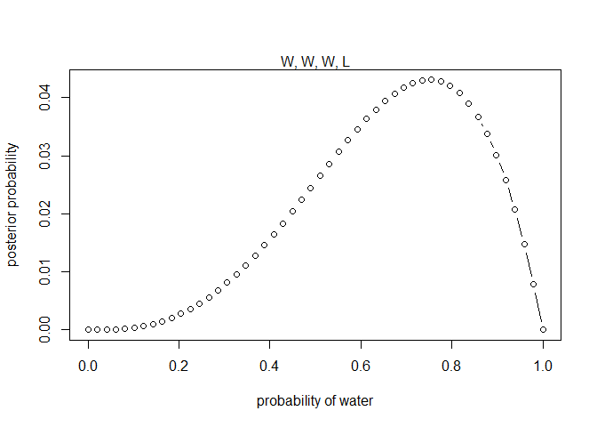
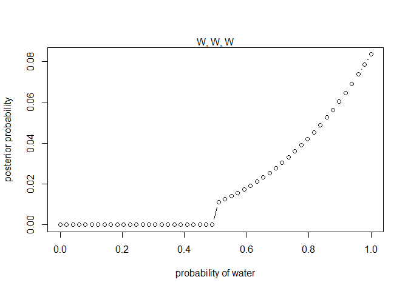
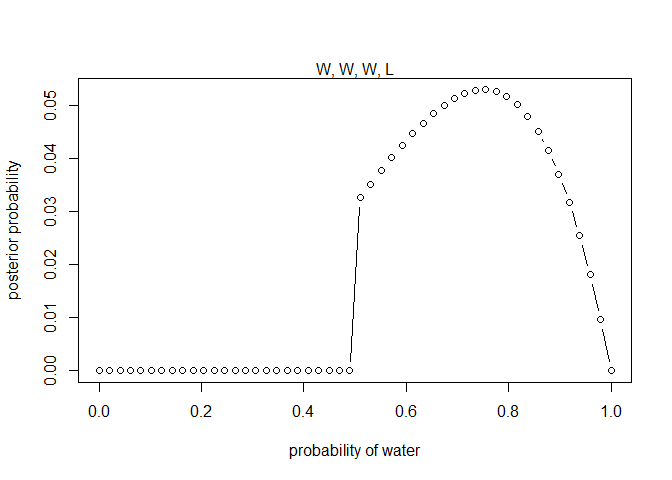
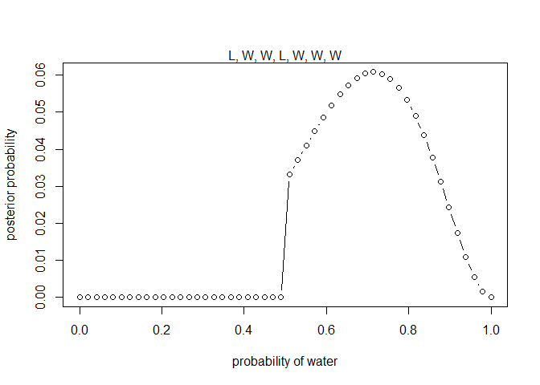

###Chapter 2 
####2019_04_12

**2E1**   
Which expressions coorelate to the statement: *the probability of rain on Monday*  
(1) Pr(rain)  
**(2) Pr(rain|Monday)**  
**(3) Pr(Monday|rain)**  
**(4) Pr(rain, Monday)/ Pr(Monday)** (Pr rain and Monday / Pr Monday?)  

**2E2**   
Which statements coorespond to the expression: Pr(Monday|rain)  
(1) The probability of rain on Monday.  
(2) The probability of rain, given that it is Monday.  
**(3) The probability that it is Monday, given that it is raining.**  
(4) The probability that it is Monday and that it is raining  

**2E3**  
which expressions coorelate to the statement: *the probability that it is Monday, given that it is raining*  
**(1) Pr(Monday|rain)**  
(2) Pr(rain|Monday)  
(3) Pr(rain|Monday) Pr(Monday)  
**(4) Pr(rain|Monday) Pr(Monday)/ Pr(rain)**  
(5) Pr(Monday|rain) Pr(rain)/ Pr(Monday)  

**2M1**  
Compute and plot the grid approximate posterior dist. for each of the following sets of observations. Assume a uniform prior for *p*.

1) W, W, W

```r
# define grid, arbitraily picking 50
p_grid <- seq( from=0 , to=1 , length.out=50)

# define prior, here it is uniform 
prior <- rep( 1 , 50 )

# compute likelihood at each value in grid, (w, w, w)
likelihood <- dbinom( 3 , size=3 , prob=p_grid )

# compute product of likelihood and prior 
unstd.posterior <- likelihood * prior

# standardize the posterior, so it sums to 1 
posterior <- unstd.posterior / sum(unstd.posterior)

plot( p_grid , posterior , type="b" , xlab="probability of water" , ylab="posterior probability" )
mtext("W, W, W")
```

<!-- -->

2) W, W, W, L

```r
# define grid, arbitraily picking 50
p_grid <- seq( from=0 , to=1 , length.out=50)

# define prior, here it is uniform 
prior <- rep( 1 , 50 )

# compute likelihood at each value in grid, (w, w, w)
likelihood <- dbinom( 3 , size=4 , prob=p_grid )

# compute product of likelihood and prior 
unstd.posterior <- likelihood * prior

# standardize the posterior, so it sums to 1 
posterior <- unstd.posterior / sum(unstd.posterior)

plot( p_grid , posterior , type="b" , xlab="probability of water" , ylab="posterior probability" )
mtext("W, W, W, L")
```

<!-- -->

3) L, W, W, L, W, W, W

```r
# define grid, arbitraily picking 50
p_grid <- seq( from=0 , to=1 , length.out=50)

# define prior, here it is uniform 
prior <- rep( 1 , 50 )

# compute likelihood at each value in grid, (w, w, w)
likelihood <- dbinom( 5 , size=7 , prob=p_grid )

# compute product of likelihood and prior 
unstd.posterior <- likelihood * prior

# standardize the posterior, so it sums to 1 
posterior <- unstd.posterior / sum(unstd.posterior)

plot( p_grid , posterior , type="b" , xlab="probability of water" , ylab="posterior probability" )
mtext("L, W, W, L, W, W, W")
```

<!-- -->


**2M2**  
Now assume a prior for p that is equal to zero when p < 0.5 and is a positive constant when
p ≥ 0.5. Again compute and plot the grid approximate posterior distribution for each of the sets of
observations in the problem just above.

1) W, W, W

```r
# define grid, arbitraily picking 50
p_grid <- seq( from=0 , to=1 , length.out=50)

# define prior, here it is uniform 
prior <- ifelse( p_grid < 0.5 , 0 , 1 )

# compute likelihood at each value in grid, (w, w, w)
likelihood <- dbinom( 3 , size=3 , prob=p_grid )

# compute product of likelihood and prior 
unstd.posterior <- likelihood * prior

# standardize the posterior, so it sums to 1 
posterior <- unstd.posterior / sum(unstd.posterior)

plot( p_grid , posterior , type="b" , xlab="probability of water" , ylab="posterior probability" )
mtext("W, W, W")
```

<!-- -->

2) W, W, W, L

```r
# define grid, arbitraily picking 50
p_grid <- seq( from=0 , to=1 , length.out=50)

# define prior, here it is uniform 
prior <- ifelse( p_grid < 0.5 , 0 , 1 )

# compute likelihood at each value in grid, (w, w, w)
likelihood <- dbinom( 3 , size=4 , prob=p_grid )

# compute product of likelihood and prior 
unstd.posterior <- likelihood * prior

# standardize the posterior, so it sums to 1 
posterior <- unstd.posterior / sum(unstd.posterior)

plot( p_grid , posterior , type="b" , xlab="probability of water" , ylab="posterior probability" )
mtext("W, W, W, L")
```

<!-- -->

3) L, W, W, L, W, W, W

```r
# define grid, arbitraily picking 50
p_grid <- seq( from=0 , to=1 , length.out=50)

# define prior, here it is uniform 
prior <- ifelse( p_grid < 0.5 , 0 , 1 )

# compute likelihood at each value in grid, (w, w, w)
likelihood <- dbinom( 5 , size=7 , prob=p_grid )

# compute product of likelihood and prior 
unstd.posterior <- likelihood * prior

# standardize the posterior, so it sums to 1 
posterior <- unstd.posterior / sum(unstd.posterior)

plot( p_grid , posterior , type="b" , xlab="probability of water" , ylab="posterior probability" )
mtext("L, W, W, L, W, W, W")
```

<!-- -->


**2M3**  
Suppose there are two globes, one for Earth and one for Mars. The Earth globe is 70% covered
in water. The Mars globe is 100% land. Further suppose that one of these globes—you don’t know
which—was tossed in the air and produced a “land” observation. Assume that each globe was equally
likely to be tossed. Show that the posterior probability that the globe was the Earth, conditional on
seeing “land” (Pr(Earth|land)), is 0.23.


Pr(land) = 30/100 earth + 100/100 mars = 130/200 -> prior for land  
Pr(E|land) = 30/130 land is earth  

```r
30/130
```

```
## [1] 0.2307692
```

**2M4**   
Suppose you have a deck with only three cards. Each card has two sides, and each side is either
black or white. One card has two black sides. The second card has one black and one white side. The
third card has two white sides. Now suppose all three cards are placed in a bag and shuffled. Someone
reaches into the bag and pulls out a card and places it flat on a table. A black side is shown facing up,but you don’t know the color of the side facing down. Show that the probability that the other side is also black is 2/3. Use the counting method (Section 2 of the chapter) to approach this problem. This means counting up the ways that each card could produce the observed data (a black side facing up
on the table).

|card| face up | face down | path   |
|----|---------|-----------|---------|
| BB1 | B | B | correct path|
| BB2 | B | B | correct path|
| BW1 | B | W | possible but not correct|
| BW2 | W | B | not possible|
| WW1 | W | W | not possible|
| WW2 | W | w | not possible|

3 possible paths given black face up  
2 paths that have black face down

Pr(black down | black up) = 2/3 paths 

**2M5**  
Now suppose there are four cards: B/B, B/W, W/W, and another B/B. Again suppose a card is
drawn from the bag and a black side appears face up. Again calculate the probability that the other
side is black.

|card| face up | face down | path   |
|----|---------|-----------|---------|
| BB1.1 | B | B | correct path|
| BB1.2 | B | B | correct path|
| BW1 | B | W | possible but not correct|
| BW2 | W | B | not possible|
| WW1 | W | W | not possible|
| WW2 | W | w | not possible|
| BB2.1 | B | B | correct path|
| BB2.2 | B | B | correct path|

5 possible paths  
4 paths have black face down  

Pr(black down | black up) = 4/5
